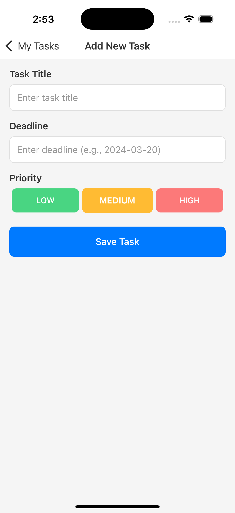
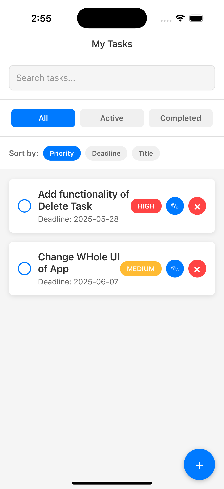

# 📋 TaskManagerApp

**TaskManagerApp** is a feature-rich mobile application built with **React Native** using the **Cursor editor**. It is designed to help users efficiently manage tasks through a clean and intuitive interface. From creating tasks to sorting by priority, the app delivers a seamless task management experience.

---

## 📝 Project Description

TaskManagerApp empowers users to organize and track their daily activities with ease. It combines essential task management features—like creation, editing, completion tracking, search, and sorting—into a smooth and responsive mobile experience.

Developed entirely using **Cursor**, this project demonstrates clean code practices, effective state management, and thoughtful UI/UX design in React Native.

---

## ✨ Features

- ✅ **Create, Edit, and Delete Tasks**  
- 📌 **Mark Tasks as Complete or Incomplete**  
- 🔍 **Search Tasks** by Title or Deadline  
- 🎯 **Filter Tasks** by Completion Status (Completed / Incomplete)  
- 🗂️ **Sort Tasks** by:
  - Priority (High to Low)
  - Deadline (Earliest to Latest)
  - Title (Alphabetical)
- 🔄 **All features work together seamlessly** for a frictionless user experience

---

## 🚀 Getting Started

### Clone the repository:

```bash
git clone https://github.com/tvisha-dhami36/TaskManagerApp.git
cd TaskManagerApp

Install dependencies:
npm install

Run the app:
npx react-native run-android   # For Android
npx react-native run-ios       # For iOS (Mac only)


🛠 Tech Stack
React Native
Cursor Editor
JavaScript
React Hooks (useState, useEffect, etc.)

📸 Screenshots



📄 License
This project is licensed under the MIT License.

🙋‍♀️ Author
Tvisha Dhami
GitHub: @tvisha-dhami36

📌 Note
This app was developed entirely using the Cursor editor, showcasing a modern development workflow focused on speed, AI-assisted coding, and clean architecture.
